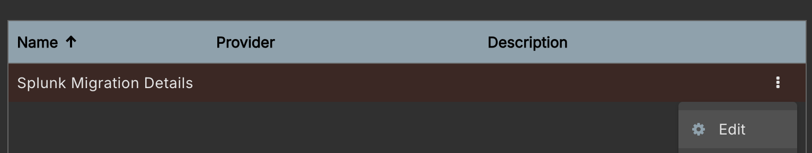

# NiFi Splunk Data Exporter

A project aimed to support the migration of Splunk data into a supported endpoint. Other free tools require high levels of manual interaction for large data sets.

## Limitations
- Requires Splunk API acesss via HTTP
- Requires Elastic Agent using Custom HTTP Input

## Prerequisites
- Docker and Docker Compose installed onto system
- Enough memory to allocate to the JVM to sufficiently handle data. Minimum suggested 4GB JVM


## How to deploy NiFi
1. Modify 'nifi.env' with required information
2. Enable the environment variables with ```source nifi.env``` or ```. nifi.env```
3. Start the container with ```docker compose -f docker-compose.nifi.yml up -d```
4. Access NiFi UI via a browser. The URL would have been printed to terminal from Step 2
5. Username and Password set in Step 1. These will not be printed to terminal

## How to deploy migration flow
1. Upload "Get_Splunk_Data.json"
***
 
***
 
***
 
***

*** 

## How to configure flow paramters
The flow is configured via parameters which are used multiple times throughout.
1. Open the Parameter Contexts menu
***

***

***

***

# TODO
1. Enable SSL Context Service(s) (TLS) for Splunk and Elastic Agent connections
2. Add ISO8601 timestamp compatibility
